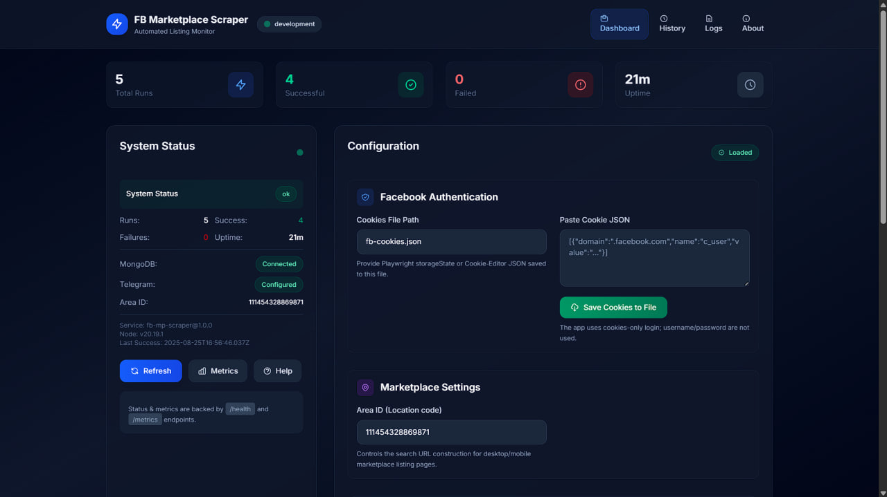
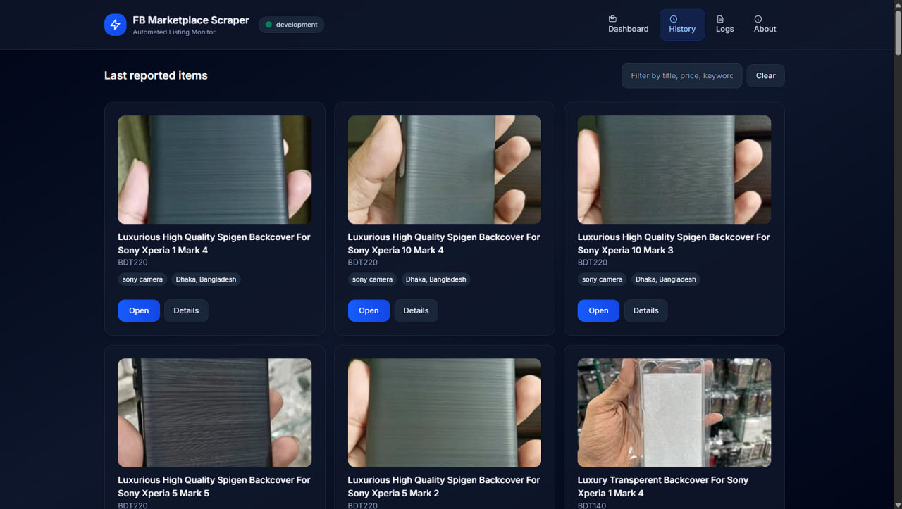
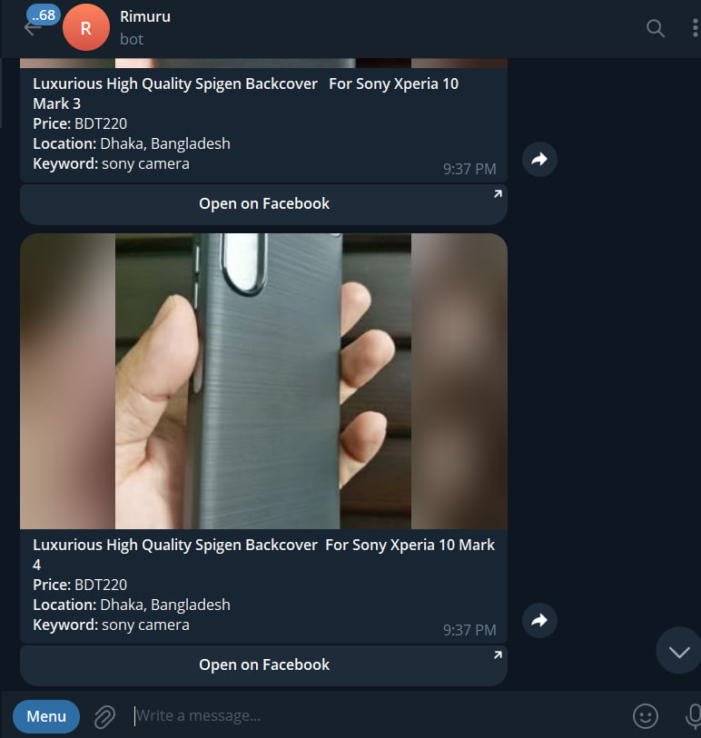

# FB Marketplace Scraper + Telegram Reporter

A **Free and Open Source** project that monitors Facebook Marketplace for specific keywords and instantly reports new listings to your Telegram chats.  
Powered by **Playwright** for scraping, **Express + EJS + Tailwind** for the dashboard, and **MongoDB** for state/history.

---

## ✨ Features
- 🔍 Scrapes FB Marketplace with Playwright
- 🍪 Cookie-based authentication 
- 📬 Instant Telegram notifications with captions & media 
- 📊 Web dashboard (EJS + Tailwind) to:
  - View service health, logs, and history of reported items.
  - Manage runtime configuration (keywords, interval, proxy, Telegram settings).
  - Import/export cookies.
- 📈 Prometheus metrics at `/metrics` and JSON health at `/health`
- 🗄 MongoDB backend with deduplication and history
- 🚀 Docker-ready, installs Playwright browsers inside container.

---

## 📸 Preview

### Dashboard  


### History  


### Telegram Alerts  


---

## 📦 Installation

Clone and install dependencies:

```bash
git clone https://github.com/tas33n/fb-marketplace-scraper.git
cd fb-marketplace-scraper
npm install
````

Install Playwright browsers (locally):

```bash
npx playwright install
```

---

## ⚙️ Configuration

1. Copy the example env file:

   ```bash
   cp .env.example .env
   ```

2. Edit `config.json` or environment variables:

   * **Dashboard key**: `DASHBOARD_KEY`
   * **Facebook cookies path**: `FB_COOKIES_PATH` (default: `fb-cookies.json`)
   * **Telegram**: `TELEGRAM_BOT_TOKEN`, `TELEGRAM_CHAT_IDS`
   * **MongoDB**: `DATABASE_URL`, `DB_NAME`
   * **Scraping**: `SCRAPE_KEYWORDS`, `SCRAPE_INTERVAL_SECONDS`, etc.

3. Import fresh cookies (via Cookie-Editor JSON) into `fb-cookies.json`.

---

## ▶️ Running

Development (with logging, non-headless):

```bash
npm run dev
```

Production (headless Playwright, optimized logging):

```bash
npm start
```

Access the dashboard at [http://localhost:3000](http://localhost:3000).

---

## 🐳 Docker

Build and run:

```bash
docker build -t fb-mp-scraper .
docker run -it --rm -p 3000:3000 \
  -v $(pwd)/data:/app/data \
  fb-mp-scraper
```

By default it uses port **3000** (configurable in `config.json` or env).

---

## 🤝 Contributing

PRs are welcome! This is a community-driven project. Ideas, bug reports, and feature requests are encouraged.

* Fork and branch from `main`.
* Follow ES6+ best practices.
* Keep code modular (`/src/scraper`, `/src/services`, `/src/views`).
* Add/update documentation where necessary.

---

## 🔧 Tech Stack

* **Node.js** (Express, EJS, TailwindCSS via CDN)
* **Playwright** for scraping
* **MongoDB** for persistence
* **Telegram Bot API** for notifications
* **Docker** for containerization
* **Prometheus** for metrics

---

## 📜 License

MIT © [Tas33n](https://github.com/tas33n)&#x20;

````
